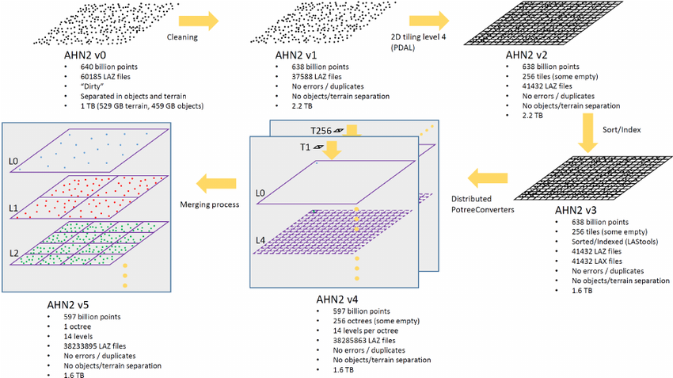

# Massive-PotreeConverter

[](https://doi.org/10.5281/zenodo.910906)

The [PotreeConverter](https://github.com/potree/PotreeConverter) builds potree octree from laz files.
When you have very many or big laz files then running a single PotreeConverter job will take a very long time.
The Massive-PotreeConverter reduces the wallclock time of creating the octree by a divide and conquer approach.
It does this by creating octree's in parallel and merging the octree's into a single octree.

This repository extends the [PotreeConverter](https://github.com/potree/PotreeConverter)
through a bunch of Python scripts to make it able to convert massive
point clouds to the Potree-OctTree format.

Massive-PotreeConverter consists of four steps, all executable through command-line tools.
The steps to convert a massive point cloud into the Potree-OctTree are:
- Determine the bounding cube of the massive point cloud.
- Split the point cloud in tiles following a special tiling schema.
- For all the tiles run PotreeConverter to create Potree-OctTrees. We use pycoeman (https://github.com/NLeSC/pycoeman).
- Merge the multiple Potree-OctTrees into a single massive Potree-OctTree.

All these steps are summarized in the following scheme: . 

For a detailed description of each step the user should read [**Taming the beast: Free and open-source massive point cloud web visualization**](http://dx.doi.org/10.13140/RG.2.1.1731.4326/1).

In addition, this repository also contains tools to:
 - Sort and index a bunch of LAS/LAZ files in parallel.
 - Dump the extents of a bunch of LAS/LAZ files into a PostGIS database. This is useful for LAStools as a pre-filter step when dealing with large number of files.
 - Dump the extents of the nodes of a Potree-OctTree into a PostGIS database. Each node of the tree is stored in a separate file.

These additional tools can be used to make rectangular selections on the raw data or in the different levels of the Potree-OctTree offering a multi-level selection tool. This is for example done in https://github.com/NLeSC/ahn-pointcloud-viewer-ws/blob/master/src/main/python/create_user_file.py. In this example a LAS/LAZ file is created from the selected data.

Massive-PotreeConverter has been used for the Dutch [AHN2](http://ahn2.pointclouds.nl) with 640 Billion points.

## Requirements

The following libraries/packages are required for the basic components of Massive-PotreeConverter:

- [PDAL](http://www.pdal.io/)
- [PotreeConverter](https://github.com/potree/PotreeConverter)
- [pycoeman](https://github.com/NLeSC/pycoeman)
- [LAStools](http://rapidlasso.com/lastools/) (the open-source license is enough). The *<path_to_lastools>/bin* should be added to the Linux **PATH**.

Concretely the following command-line tools must be available: pdal, PotreeConverter, coeman-par-local (or coeman-par-sge or coeman-par-ssh), lasinfo and lasmerge

For now Massive-PotreeConverter works only in Linux systems. Requires Python 3.5.

There is a Dockerfile available and a image build in [Docker Hub](https://registry.hub.docker.com/u/oscarmartinezrubi/massive-potreeconverter/). See end of page for information on how to use it.

## Installation

Clone this repository and install it with pip (using a virtualenv is recommended):

```
git clone https://github.com/NLeSC/Massive-PotreeConverter
cd Massive-PotreeConverter
pip install .
```

or install directly with:

```
pip install git+https://github.com/NLeSC/Massive-PotreeConverter
```

### Installation for additional steps

In order to perform the additional components some additional libraries/packages have to be installed:

- To insert extents LAS/LAZ files a Potree-OctTrees in a PostGIS database, the additional requirements are:
  - PostgreSQL, PostGIS
  - Python modules: psycopg2

- To sort/index LAS/LAZ files in parallel (allowing faster selection), the additional requirements are:
  - LAStools with license. For the licensed-part of LAStools to run in Linux environments wine (https://www.winehq.org/) needs to be installed

### Installation tips

For the installation of PotreeConverter look at https://github.com/potree/PotreeConverter. You will need to add the build executable manually to the PATH.

Look at the web page of [PDAL](http://www.pdal.io/compilation/unix.html) to install it. You will need to install also GDAL, Geos, GeoTiff and LASzip. Note that for Massive-PotreeConverter there is no need to build PDAL with PostgreSQL support.


## Method

More detailed steps:

- mpc-info: We get the bounding cube, the number of points and the average density of the massive point cloud.
First argument is the input folder with all the input data. Second argument is the number of processes we want to use to get the information.
The tool also computes suggested values for the number of tiles and for the Cubic Axis Aligned Bounding Box (CAABB), the spacing, the number of levels and suggested potreeconverter command. These values must be used in the next steps! Assuming [laz input directory] is a folder with a bunch of LAS or LAZ files, run:
```
mpc-info -i [laz input directory] -c [number processes]
```

- We use `mpc-tiling` to create tiles and we use the previous computed (by `mpc-info`)
number of tiles and CAABB (only X and Y coordinates). Note that the number of tiles
must be power of 4, in this way and thanks to the used
bounding box, the extents of the tiles will match the extent of the OctTree
nodes at a certain level (and thus the future merging will be done faster)
```
mpc-tiling -i input -o tiles -t temp -e "[minX] [minY] [maxX] [maxY]" -n [number tiles] -p [number processes]
```

- Run the individual PotreeConverters for each tile using ALWAYS the same
previously computed CAABB, spacing and number of levels.
Use `mpc-create-config-pycoeman` to create a XML with the list of PotreeConverter commands that have to be executed.
The format used is the parallel commands XML configuration file format for pycoeman.
Then run any of the pycoeman tools to execute the commands. There are options to run them locally, in a SGE cluster or in a bunch of ssh-reachable hosts.
In all cases it is not recommended to use more than 8 cores per machine since the processing is quite IO-bound. The example is using pycoeman locally in which case `.` must be the parent folder of `tiles`. For other pycoeman parallel commands execution modes visit https://github.com/NLeSC/pycoeman.
```
mpc-create-config-pycoeman -i tiles -o ParallelPotreeConverter.xml -f [format LAS or LAZ] -l [levels] -s [spacing] -e "[minX] [minY] [minZ] [maxX] [maxY] [maxZ]"
coeman-par-local -d . -c ParallelPotreeConverter.xml -e ParallelExecution -n [number processes]
```

- After the various Potree-OctTrees are created (one per tile) we need to merge them
into a single one. For this you need to use the `mpc-merge` tool which
joins two Potree-OctTrees into one.
You need to run different iterations until there is only one Potree-OctTree
The script `mpc-merge-all` can be used to merged all the Potree-OctTrees into one
but this has to be used carefully. The final Potree-Octree will be the folder in `Potree-OctTrees-merged` with the highest merging value.
```
mkdir Potree-OctTrees
mv ParallelExecution/*/* Potree-OctTrees
mpc-merge-all -i Potree-OctTrees -o Potree-OctTrees-merged -m
```

See an example in [AHN2](http://ahn2.pointclouds.nl).
For this web also the following repositories where used:

 - https://github.com/NLeSC/ahn-pointcloud-viewer
 - https://github.com/NLeSC/ahn-pointcloud-viewer-ws

### Optional steps

- Index and sort the raw data (we consider raw data the data before the 2D tiling). Since we are running it on a Linux system we need [wine](https://www.winehq.org/) to run *lassort.exe*. Hence, before the user runs `mpc-sort-index` (s)he should set the environment variable *LASSORT*.
```
export LASSORT="wine <path_to_lastools>/bin/lassort.exe"
```

- Fill a DB with the extents of the files in the raw data. Before running `mpc-db-extents`, first create an user, a DB and add the postgis extension:
```
#login into postgres
sudo -u postgres psql

> create user <your_linux_user_name> with password '<password>';
> create database pc_extents owner <your_linux_user_name>;
> \connect pc_extents
> create extension postgis
> \q
```

- Fill a DB with the extents of the files in the potree octree. Run the `mpc-db-extents-potree`

## Docker

We have created a Dockerfile to use the basic tools of Massive-PotreeConverter.
It is meant to help you when running `mpc-info`, `mpc-tiling`, `mpc-create-config-pycoeman`, `coeman-par-local` and `mpc-merge` (or `mpc-merge-all`)

Don't know about Docker? See [Docker](https://www.docker.com/)

There is also an image build in [Docker Hub](https://registry.hub.docker.com/u/oscarmartinezrubi/massive-potreeconverter/) that can be directly pulled and worked with!

In addition to installing all the required software it also creates three volumnes (/data1, /data2, /data3) which are meant to be mounted from different devices when executing docker run. Ideally always try to run in a way that the input data is in one device and the output in another (we actually have 3 volumes because of temp data folder required by `mpc-tiling`)

An example of using Massive-PotreeConverter through docker:

- Build the Massive-PotreeConverter docker image from the Dockerfile in this GitHub repository or pull the image from Docker Hub. The following instructions assume that the first option was used. If you pulled the image from Docker you will need to replace the image name.
```
cd /path/to/Massive-PotreeConverter
docker build -t oscar/mpc:v1 .
# OR
docker pull oscarmartinezrubi/massive-potreeconverter
```

- Assuming that our LAZ/LAS files are in `/media/data/big/sample`, run `mpc-info` to know the point cloud details:
```
docker run -v /media/data/big/sample:/data1 oscar/mpc:v1 mpc-info -i /data1 -c 4
```

- Run `mpc-tiling` to generate tiles (use the number of tiles and X,Y values of the CAABB suggested in the previous step). Note that we specify 3 different local folders which will be available in the docker container, one for the input data, one for the output and one for the temporal data. Also note that a local file in `/media/data/big/sample/myfile` is accessed as `/data1/myfile` in the container.
```
docker run -v /media/data/big/sample:/data1 -v /media/data/big/sample_tiles:/data2 -v /media/data/big/sample_tiles_temp:/data3 oscar/mpc:v1 mpc-tiling -i /data1/ -o /data2/ -t /data3/ -e "1555 1749 21659 21853" -n 4 -p 4
```

- Run `mpc-create-config-pycoeman` to create the XML configuration file for the different PotreeConverters. Then run them in parallel in the local machine with `coeman-par-local`. Note that we use the details suggested by `mpc-info` for the PotreeConverters. Note that pycoeman can also be used to run the various PotreeConverters in a SGE cluster or in a bunch of ssh-reachable machines. However, the docker instance is only meant for local executions. To use SGE clusters or a bunch of ssh-reachable machines you need to install Massive-PotreeConverter and dependencies in all the involved machines.
```
mkdir /media/data/big/sample_distpotree
docker run -v /media/data/big/sample_distpotree:/data1 -v /media/data/big/sample_tiles:/data2 oscar/mpc:v1 mpc-create-config-pycoeman -i /data2 -o /data1/ParallelPotreeConverter.xml -f LAZ -l 9 -s 83 -e "1555 1749 -94 21659 21853 20010"
docker run -v /media/data/big/sample_distpotree:/data1 -v /media/data/big/sample_tiles:/data2 oscar/mpc:v1 coeman-par-local -d / -c /data1/ParallelPotreeConverter.xml -e /data1/execution -n 4
```

- Run the script to merge all the Potree-OctTrees into one. Note that in this case we only mount and use one volume. For this specific script it is better to have the same device for both input and output.
```
sudo mv sample_distpotree/execution/*/* sample_distpotree/poctrees/
docker run -v /media/data/big/sample_distpotree:/data1 oscar/mpc:v1 mpc-merge-all -i /data1/poctrees -o /data1/poctrees_merge -m
```
